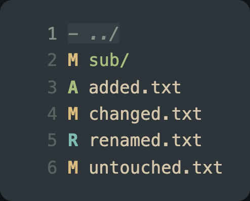

# oh-my-oil

A fork of [oil.nvim](https://github.com/stevearc/oil.nvim) by [stevearc](https://github.com/stevearc), maintained by [mercenarioZ](https://github.com/mercenarioZ). It merges [voil.nvim](https://github.com/mercenarioZ/voil.nvim) into oil.nvim, and its version line starts over at 0.1.0 instead of following upstream.

Like oil.nvim, it is a [vim-vinegar](https://github.com/tpope/vim-vinegar) like file explorer that lets you edit your filesystem like a normal Neovim buffer. On top of that, voil's version control status column is built in, so the state of every entry comes straight from jj or git.



<!-- TOC -->

- [Requirements](#requirements)
- [Installation](#installation)
- [Quick start](#quick-start)
- [Version control status](#version-control-status)
- [Adapters](#adapters)
- [Options](#options)
- [Documentation](#documentation)
- [License](#license)

<!-- /TOC -->

## Requirements

- Neovim 0.10+ (for older versions, use an [nvim-0.x branch](https://github.com/stevearc/oil.nvim/branches) of upstream)
- Icon provider plugin (optional)
  - [mini.icons](https://github.com/nvim-mini/mini.nvim/blob/main/readmes/mini-icons.md) for file and folder icons
  - [nvim-web-devicons](https://github.com/nvim-tree/nvim-web-devicons) for file icons

## Installation

lazy.nvim:

```lua
{
  'mercenarioZ/oh-my-oil.nvim',
  ---@module 'oil'
  ---@type oil.SetupOpts
  opts = {},
  -- Optional dependencies
  dependencies = { { "nvim-mini/mini.icons", opts = {} } },
  -- dependencies = { "nvim-tree/nvim-web-devicons" }, -- use if you prefer nvim-web-devicons
  -- Lazy loading is not recommended because it is very tricky to make it work correctly in all situations.
  lazy = false,
}
```

Any other plugin manager works too; see the [upstream installation instructions](https://github.com/stevearc/oil.nvim#installation) if you need a snippet for yours. The Lua module is still called `oil`, so switching from oil.nvim is a one-line change in the plugin spec.

## Quick start

```lua
require("oil").setup()
```

Open a directory with `nvim .`. Use `<CR>` to open a file or directory, and `-` to go up a directory. Otherwise just treat it like a normal buffer: make the changes you want and `:w` to apply them.

To mimic the `vim-vinegar` method of navigating to the parent directory of a file, add this keymap:

```lua
vim.keymap.set("n", "-", "<CMD>OhMyOil<CR>", { desc = "Open parent directory" })
```

A directory opens with `:edit <path>` or `:OhMyOil <path>`, or in a floating window with `:OhMyOil --float <path>`. `:OMO` is a short alias for the same command, and `--float`, `--trash`, `--preview` and `--progress` are the other arguments; see `:help oil-commands`.

## Version control status

Add the `vcs` column to the listing to show the state of every entry, straight from jj or git:

```lua
require("oil").setup({
  columns = { "icon", "vcs", "mtime" },
})
```

`M` modified, `A` added, `D` deleted, `R` renamed, `C` copied, `?` untracked, `!` ignored, `-` clean. A directory carries the most severe status of the files inside it, so a directory whose contents changed is visible without entering it.

The backend is picked per directory: `vcs.backends` lists the names to try, in order, and the directory's closest repository wins (`jj` then `git` by default), so a checkout nested inside another one belongs to the inner one. Further backends can be registered with `require("oil.vcs").register_backend()`. Symbols, colors, retry behavior and refresh triggers are options in the [`vcs` table](#options).

`require("oil.vcs").refresh()` refetches and redraws every directory the column has fetched, and `require("oil.vcs").get_status(dir)` returns the status of one directory as `{ [entry name] = code }`. The column is read-only, works on the local filesystem only, and shows whatever the backend reports.

See `:help oil-vcs` for the backends, the highlight groups, and the API.

## Adapters

Oil does all of its filesystem interaction through an _adapter_ abstraction, so it can view and modify files in more places than the local filesystem. File operations work _across_ adapters: copying a file to or from a remote server uses the same edit-then-`:w` flow as a local copy.

- SSH: `nvim oil-ssh://[username@]hostname[:port]/[path]`
- S3: `nvim oil-s3://[bucket]/[path]`

The ssh adapter needs a POSIX server (`/bin/sh` plus the usual unix commands) and does not support Windows. On Neovim 0.11 and older the S3 url starts with `oil-sss`, because older versions do not accept digits in urls.

## Options

Every option, with its default, is in `:help oil-config`, which is the same text as [doc/oil.txt](doc/oil.txt). The defaults are defined in [`lua/oil/config.lua`](lua/oil/config.lua).

## Documentation

The reference documentation is upstream oil.nvim's and applies unchanged, except that the user command is `:OhMyOil` (`:OMO` for short) instead of `:Oil`.

- `:help oil` — options, commands, columns, actions, highlights, trash, and the version control column
- [doc/api.md](doc/api.md) — Lua API
- [doc/recipes.md](doc/recipes.md) — recipes
- [CHANGELOG.md](CHANGELOG.md) — release notes
- [Upstream README](https://github.com/stevearc/oil.nvim#readme) — original documentation, FAQ, and alternatives

## License

MIT. See [LICENSE](LICENSE); the upstream copyright is Steven Arcangeli's.
